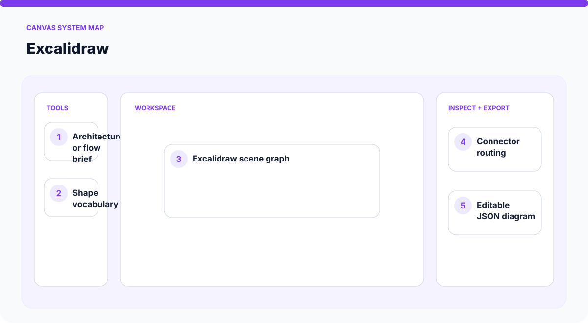
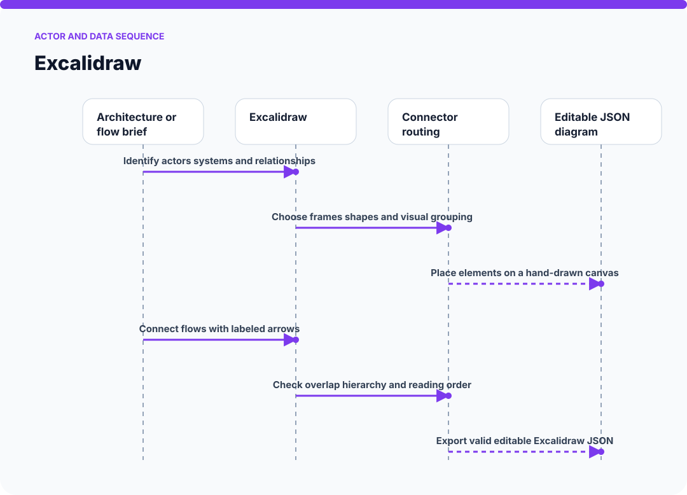
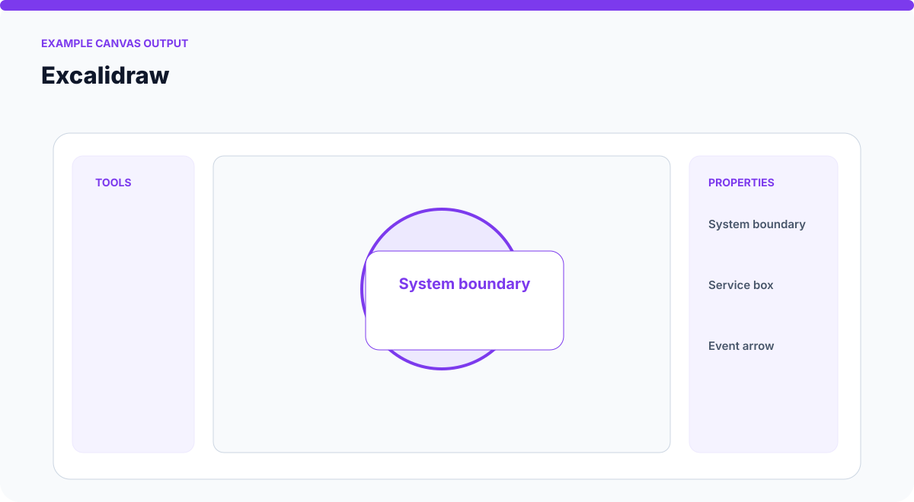
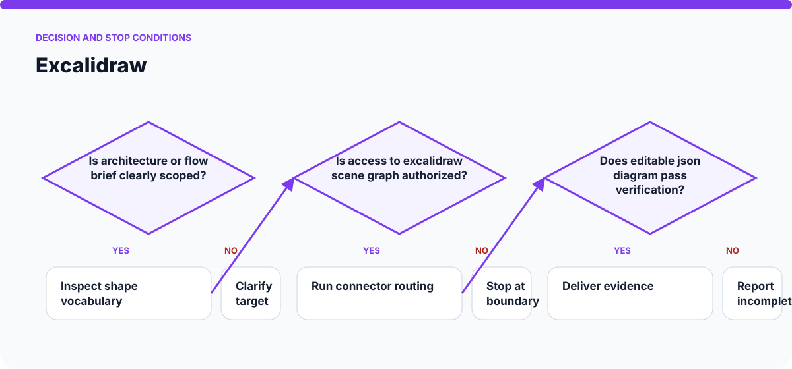

# How Excalidraw Works

The visuals on this page are static SVGs, so they render directly on GitHub on phones and desktop browsers. Each one is generated from a model specific to this skill.

## System architecture

### Components

- **1. Architecture or flow brief:** participates in identify actors systems and relationships.
- **2. Shape vocabulary:** participates in choose frames shapes and visual grouping.
- **3. Excalidraw scene graph:** participates in place elements on a hand-drawn canvas.
- **4. Connector routing:** participates in connect flows with labeled arrows.
- **5. Editable JSON diagram:** participates in check overlap hierarchy and reading order.

## Actor and data sequence

### 1. Identify actors systems and relationships

**Primary surface:** `Architecture or flow brief`

Record the concrete input, the operation performed, and the evidence produced at this stage. Continue only when the output is sufficient for the next stage; otherwise preserve the blocker and stop.
### 2. Choose frames shapes and visual grouping

**Primary surface:** `Shape vocabulary`

Record the concrete input, the operation performed, and the evidence produced at this stage. Continue only when the output is sufficient for the next stage; otherwise preserve the blocker and stop.
### 3. Place elements on a hand-drawn canvas

**Primary surface:** `Excalidraw scene graph`

Record the concrete input, the operation performed, and the evidence produced at this stage. Continue only when the output is sufficient for the next stage; otherwise preserve the blocker and stop.
### 4. Connect flows with labeled arrows

**Primary surface:** `Connector routing`

Record the concrete input, the operation performed, and the evidence produced at this stage. Continue only when the output is sufficient for the next stage; otherwise preserve the blocker and stop.
### 5. Check overlap hierarchy and reading order

**Primary surface:** `Editable JSON diagram`

Record the concrete input, the operation performed, and the evidence produced at this stage. Continue only when the output is sufficient for the next stage; otherwise preserve the blocker and stop.
### 6. Export valid editable Excalidraw JSON

**Primary surface:** `Architecture or flow brief`

Record the concrete input, the operation performed, and the evidence produced at this stage. Continue only when the output is sufficient for the next stage; otherwise preserve the blocker and stop.

## Example output shape

The example is a visual contract: a real run may look different, but it should expose comparable state, provenance, and verification information. It is not presented as evidence of a live external action.

## Decision and stop conditions

The workflow stops when the target is ambiguous, the relevant surface is unavailable or unauthorized, or the final artifact cannot be checked. A logged-in session or successful tool call is not by itself proof that the requested outcome is complete.

## Verification checklist

- Confirm every component shown in the system map exists in the target environment.
- Trace the actor sequence using actual tool output or artifact state.
- Compare the result with the example-output information contract.
- Re-read or reopen the final artifact instead of trusting an attempt message.
- Report omitted stages, unsupported capabilities, and remaining human decisions.
